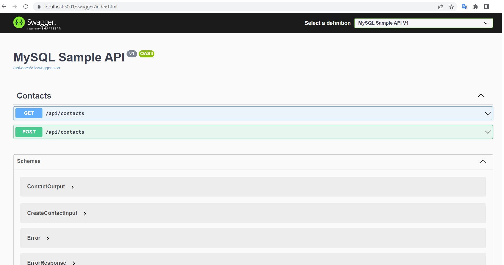
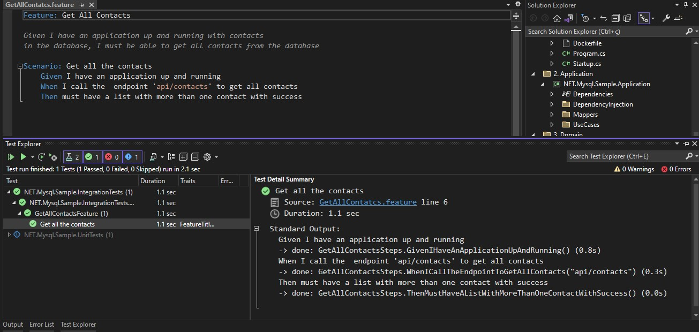

# NET.Mysql.Sample

An sample of an .NET Core Web API using [Clean Arch](https://blog.cleancoder.com/uncle-bob/2012/08/13/the-clean-architecture.html) design.

This is an functional application with use cases to list and create simple contacts, and with an example of an isolated integration test using [SpecFlow](https://specflow.org/benefits/developers-code/) wich initializes an instance of the application using its own configuration and call the endpoits available in the scenario.

Its health check is also configured, as well as how to handle with customized validations and response with a filter.

## Application

## Tests

